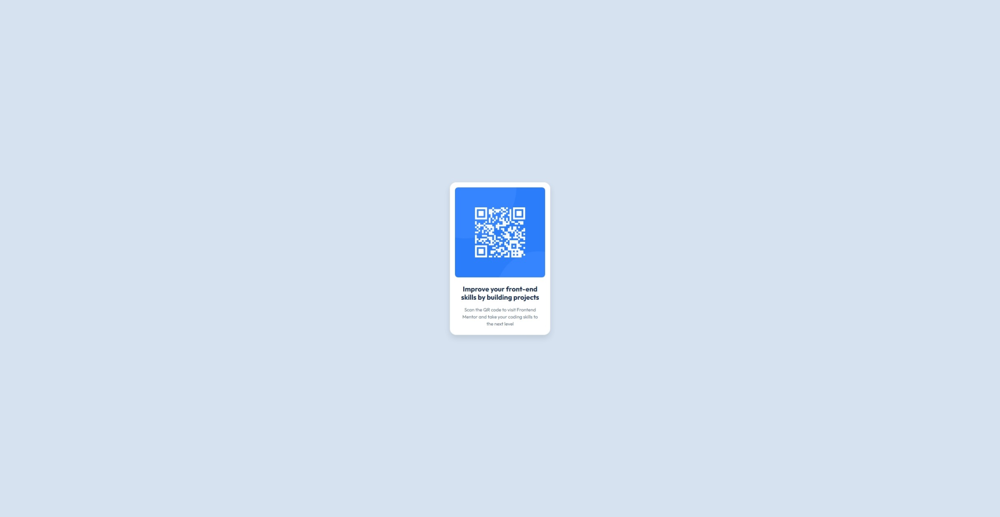

# -qr-code-component-solution
 QR Code Component Solution
# Frontend Mentor - QR code component solution

This is a solution to the [QR code component challenge on Frontend Mentor](https://www.frontendmentor.io/challenges/qr-code-component-iux_sIO_H). Frontend Mentor challenges help me improve my coding skills by building realistic projects. 

## Table of contents

- [Overview](#overview)
  - [Screenshot](#screenshot)
  - [Links](#links)
- [My process](#my-process)
  - [Built with](#built-with)
  - [What I learned](#what-i-learned)
  - [Continued development](#continued-development)
  - [Author](#author)

## Overview

### Screenshot



### Links

- Solution URL: (https://github.com/SSosnova/qr-code-component-solution)
- Live Site URL: (https://SSosnova.github.io/qr-code-component-solution/)

## My process

### Built with

- Semantic HTML5 markup
- CSS custom properties (using `var()` for consistent styling)
- Flexbox (for centering the component on the page)
- Mobile-first workflow (considering smaller screens first)

### What I learned

This project was a great refresher on fundamental HTML and CSS concepts. I particularly focused on:

- **Semantic HTML:** Ensuring the use of appropriate tags like `<h2>` and `<p>` within the card structure.
- **CSS Variables (`var()`):** Reinforcing the benefits of defining colors and font properties in a `:root` scope for easy management and consistency, as learned with the `hsl` color format.
- **Flexbox for Layout:** Solidifying the understanding of `display: flex`, `justify-content: center`, and `align-items: center` to perfectly center the component on the page, both horizontally and vertically.
- **Responsive Images:** Ensuring the `` tag correctly scales within its container using `width: 100%` and has rounded corners with `border-radius`.
- **`box-sizing: border-box;`:** Understanding its importance in simplifying layout calculations by including padding and border within an element's defined width and height.

```html
<div class="qr-code-card">
    
    <h2 class="card-title">Improve your front-end skills by building projects</h2>
    <p class="card-description">Scan the QR code to visit Frontend Mentor and take your coding skills to the next level</p>
</div>
